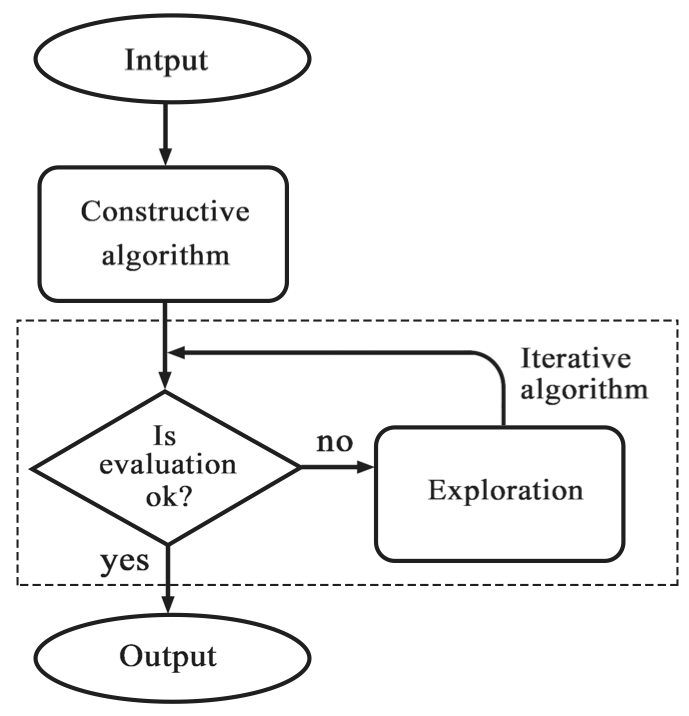

## Common Centroid Placement using Genetic Algorithm (GA) with Swap Mutation technique. 

* /cc/

    * **cc.py** - Constuctive Algorithm 

    * **eva.py** - Evaluation Algorithm 
    
    * **GA.py** - Genetic Algorithm (GA)

*an initial commit*

img[alt="minipic"] { 
  max-width:  20px; 
  display: block;
}
